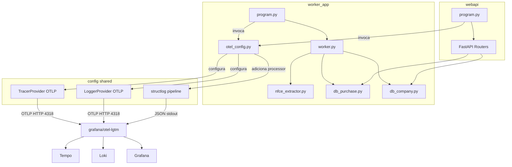
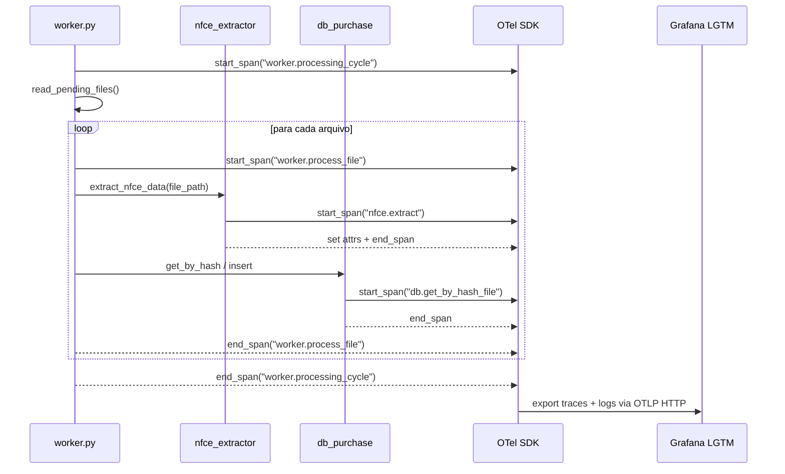

# Design Document — Observability: Logs & Traces

## Overview

Este documento descreve o design técnico para instrumentar o **Processador de Cupom Fiscal** com logs estruturados correlacionados e traces distribuídos usando OpenTelemetry, exportando para a stack Grafana LGTM (Loki + Tempo + Grafana).

O sistema possui dois aplicativos independentes — `worker_app` (loop de polling) e `webapi` (FastAPI) — que compartilham código em `src/config/`, `src/database/` e `src/services/`. A instrumentação será centralizada em um novo módulo `src/config/otel_config.py`, invocado na inicialização de cada app.

### Decisões de Design

- **Módulo compartilhado**: `OTel_Configurator` em `src/config/otel_config.py` é compartilhado entre os dois apps, parametrizado pelo nome do serviço via variável de ambiente.
- **Exportador OTLP HTTP** (porta 4318) em vez de gRPC (4317): mais simples de configurar em Python sem dependências nativas adicionais; o `grafana/otel-lgtm` aceita ambos.
- **structlog processor customizado** para injetar `trace_id` e `span_id` do contexto OTel ativo em cada evento de log, sem alterar a interface de logging existente.
- **Instrumentação manual de spans** no `worker_app` (sem framework web), usando context managers `with tracer.start_as_current_span(...)`.
- **Instrumentação automática FastAPI** via `opentelemetry-instrumentation-fastapi` (já presente em `src/webapi/requirements.txt`).
- **Spans de DB** adicionados diretamente nas funções dos repositórios (`src/database/db_*.py`), seguindo o padrão existente de receber `db` como primeiro argumento.

---

## Architecture



### Fluxo de um ciclo de processamento (worker_app)



---

## Components and Interfaces

### `src/config/otel_config.py` — OTel_Configurator

Módulo novo. Responsável por toda a inicialização do OpenTelemetry.

```python
def configure_otel(service_name: str | None = None) -> trace.Tracer:
    """
    Inicializa TracerProvider e LoggerProvider com exportadores OTLP HTTP.
    Adiciona o OtelTraceProcessor ao pipeline do structlog.
    Retorna o Tracer global para o serviço.
    """
```

**Responsabilidades:**
- Lê `OTEL_EXPORTER_OTLP_ENDPOINT`, `OTEL_SERVICE_NAME`, `OTEL_DEPLOYMENT_ENVIRONMENT`
- Cria `Resource` com `service.name`, `service.version`, `deployment.environment`
- Configura `TracerProvider` com `OTLPSpanExporter` (HTTP)
- Configura `LoggerProvider` com `OTLPLogExporter` (HTTP)
- Registra o `Tracer` global via `trace.set_tracer_provider()`
- Injeta `OtelTraceProcessor` no pipeline do `structlog`

### `OtelTraceProcessor` (interno a `otel_config.py`)

Processor structlog que injeta `trace_id` e `span_id` do span ativo:

```python
class OtelTraceProcessor:
    def __call__(self, logger, method, event_dict):
        span = trace.get_current_span()
        ctx = span.get_span_context()
        if ctx.is_valid:
            event_dict["trace_id"] = format(ctx.trace_id, "032x")
            event_dict["span_id"] = format(ctx.span_id, "016x")
        else:
            event_dict["trace_id"] = "00000000000000000000000000000000"
            event_dict["span_id"] = "0000000000000000"
        return event_dict
```

### `src/config/log_config.py` — atualização

A função `configure_logging()` existente será atualizada para aceitar uma lista de processors adicionais, permitindo que `otel_config.py` injete o `OtelTraceProcessor` sem criar dependência circular.

### `src/worker_app/program.py` — atualização

Invoca `configure_otel("worker_app")` antes do loop de polling e antes de `configure_logging()`.

### `src/webapi/program.py` — atualização

Invoca `configure_otel("webapi")` antes de `app.include_router(...)` e registra `FastAPIInstrumentor`.

### `src/worker_app/worker.py` — atualização

Adiciona spans `worker.processing_cycle` e `worker.process_file` usando o tracer global. Emite logs estruturados nos pontos-chave.

### `src/services/nfce_extractor.py` — atualização

Adiciona span `nfce.extract` com atributos `file.path`, `nfce.access_key`, `company.cnpj`.

### `src/database/db_*.py` — atualização

Cada função de repositório ganha um span filho `db.<operação>` com atributos semânticos de banco de dados.

### `src/webapi/routers/*.py` — atualização

Adiciona middleware de logging de requisição/resposta via `Request` e `Response` do Starlette, emitindo logs estruturados com `trace_id`.

---

## Data Models

### OTel Resource (compartilhado)

| Atributo                  | Fonte                              | Exemplo                        |
|---------------------------|------------------------------------|--------------------------------|
| `service.name`            | `OTEL_SERVICE_NAME`                | `"worker_app"` / `"webapi"`    |
| `service.version`         | hardcoded `"1.0.0"`                | `"1.0.0"`                      |
| `deployment.environment`  | `OTEL_DEPLOYMENT_ENVIRONMENT`      | `"development"`                |

### Span: `worker.processing_cycle`

| Atributo              | Tipo    | Descrição                              |
|-----------------------|---------|----------------------------------------|
| `pending_files_count` | `int`   | Número de arquivos encontrados         |

### Span: `worker.process_file`

| Atributo              | Tipo     | Descrição                                          |
|-----------------------|----------|----------------------------------------------------|
| `file.name`           | `string` | Nome do arquivo PDF                                |
| `file.hash`           | `string` | Hash SHA-256 do arquivo                            |
| `file.skipped_reason` | `string` | `"duplicate_hash"` ou `"duplicate_access_key"` (opcional) |

### Span: `nfce.extract`

| Atributo           | Tipo     | Descrição                          |
|--------------------|----------|------------------------------------|
| `file.path`        | `string` | Caminho completo do arquivo        |
| `nfce.access_key`  | `string` | Chave de acesso de 44 dígitos      |
| `company.cnpj`     | `string` | CNPJ da empresa emissora           |
| `error.message`    | `string` | Mensagem de erro (somente em falha)|

### Span: `db.<operação>`

| Atributo       | Tipo     | Descrição                                    |
|----------------|----------|----------------------------------------------|
| `db.system`    | `string` | `"mysql"`                                    |
| `db.name`      | `string` | Nome do banco (de `MYSQL_DATABASE`)          |
| `db.operation` | `string` | `"SELECT"`, `"INSERT"`, `"UPDATE"`           |
| `error.message`| `string` | Mensagem de erro (somente em falha)          |

### Log estruturado — campos obrigatórios

Todos os logs emitidos pelo sistema incluirão:

| Campo       | Tipo     | Descrição                                    |
|-------------|----------|----------------------------------------------|
| `trace_id`  | `string` | ID do trace ativo (32 hex chars) ou zeros    |
| `span_id`   | `string` | ID do span ativo (16 hex chars) ou zeros     |
| `event`     | `string` | Nome do evento de log                        |
| `level`     | `string` | `"info"`, `"warning"`, `"error"`             |
| `timestamp` | `string` | ISO 8601                                     |

### Variáveis de ambiente

| Variável                       | Padrão                    | Descrição                          |
|--------------------------------|---------------------------|------------------------------------|
| `OTEL_EXPORTER_OTLP_ENDPOINT`  | `http://grafana:4318`     | Endpoint OTLP HTTP do coletor      |
| `OTEL_SERVICE_NAME`            | obrigatório               | Nome do serviço (`worker_app` / `webapi`) |
| `OTEL_DEPLOYMENT_ENVIRONMENT`  | `"development"`           | Ambiente de deployment             |


---

## Correctness Properties

*A property is a characteristic or behavior that should hold true across all valid executions of a system — essentially, a formal statement about what the system should do. Properties serve as the bridge between human-readable specifications and machine-verifiable correctness guarantees.*

### Property 1: Resource attributes reflect environment configuration

*For any* combinação de `service_name`, `service_version` e `deployment_environment` fornecidos via variáveis de ambiente, o `Resource` OpenTelemetry criado pelo `OTel_Configurator` deve conter exatamente esses valores nos atributos `service.name`, `service.version` e `deployment.environment`.

**Validates: Requirements 1.3, 8.2, 8.3**

### Property 2: Tracer name matches service name

*For any* `service_name` válido passado a `configure_otel()`, o `Tracer` retornado deve ter seu `instrumenting_module_name` igual ao `service_name` fornecido.

**Validates: Requirements 1.6**

### Property 3: Log events within an active span contain correct trace and span IDs

*For any* span ativo com `trace_id` e `span_id` arbitrários, qualquer evento de log emitido dentro do contexto desse span deve conter os campos `trace_id` e `span_id` com os valores hexadecimais correspondentes ao span ativo.

**Validates: Requirements 2.1**

### Property 4: Log output is always valid JSON

*For any* evento de log com campos arbitrários (strings, números, listas), a saída emitida para stdout deve ser uma string JSON válida e parseável.

**Validates: Requirements 2.3**

### Property 5: Processing cycle span captures pending file count

*For any* lista de arquivos pendentes de tamanho N, o span `worker.processing_cycle` criado durante a execução de `process()` deve conter o atributo `pending_files_count` com valor igual a N.

**Validates: Requirements 3.1**

### Property 6: Process file span contains file identity attributes

*For any* arquivo PDF com `file_name` e `file_hash` arbitrários, o span `worker.process_file` criado durante o processamento desse arquivo deve conter os atributos `file.name` e `file.hash` com os valores correspondentes. Quando o arquivo for identificado como duplicado, o span deve adicionalmente conter o atributo `file.skipped_reason` com o valor `"duplicate_hash"` ou `"duplicate_access_key"`.

**Validates: Requirements 3.2, 3.6**

### Property 7: NFC-e extract span contains extraction result attributes

*For any* extração bem-sucedida de NFC-e, o span `nfce.extract` deve conter os atributos `file.path`, `nfce.access_key` e `company.cnpj` com os valores extraídos do PDF. Para qualquer extração que falhar, o span deve ter status `ERROR` e conter o atributo `error.message`.

**Validates: Requirements 3.3, 3.4, 3.5**

### Property 8: Database spans are always closed with correct semantic attributes

*For any* operação de repositório de banco de dados (sucesso ou falha), um span com nome no formato `db.<operação>` deve ser criado, conter os atributos `db.system="mysql"`, `db.name` e `db.operation`, e ser encerrado ao final da operação. Em caso de exceção, o span deve ter status `ERROR` com `error.message` preenchido, e a exceção original deve ser relançada.

**Validates: Requirements 4.1, 4.2, 4.3, 4.4**

### Property 9: HTTP request spans contain required semantic attributes

*For any* requisição HTTP recebida pela WebAPI, o span criado deve ter nome no formato `HTTP <METHOD> <rota>` e conter os atributos `http.method`, `http.route`, `http.status_code` e `http.url` com os valores correspondentes à requisição.

**Validates: Requirements 5.2, 5.3**

### Property 10: Incoming trace context is propagated correctly

*For any* requisição HTTP recebida com header `traceparent` válido (W3C TraceContext), o span criado pela WebAPI deve usar o `trace_id` extraído do header, mantendo a continuidade do trace distribuído.

**Validates: Requirements 5.5**

### Property 11: Worker log events contain all required fields

*For any* evento de log emitido pelo `worker_app` (início de processamento, conclusão, skip por duplicidade, ou resumo de ciclo), o evento deve conter os campos obrigatórios para aquele tipo de evento: `event`, `trace_id`, e os campos específicos do evento (`file_name`, `company_id`, `purchase_id`, `item_count`, `skipped_reason`, `processed_count`, `skipped_count`, `error_count`, `duration_ms` conforme aplicável).

**Validates: Requirements 6.1, 6.2, 6.3, 6.5**

### Property 12: WebAPI log events contain all required fields

*For any* requisição HTTP processada pela WebAPI, os logs emitidos (entrada e saída) devem conter os campos `event`, `method`, `path`, `trace_id`, e adicionalmente `status_code` e `duration_ms` no log de resposta.

**Validates: Requirements 7.1, 7.2**

### Property 13: OTLP exporter uses endpoint from environment variable

*For any* valor de URL fornecido via `OTEL_EXPORTER_OTLP_ENDPOINT`, o `OTLPSpanExporter` e o `OTLPLogExporter` configurados pelo `OTel_Configurator` devem usar exatamente esse endpoint para exportação.

**Validates: Requirements 1.1, 8.1**

---

## Error Handling

### Falha na conexão com o coletor OTLP

O SDK do OpenTelemetry exporta spans e logs de forma assíncrona em background. Se o endpoint OTLP estiver indisponível, o SDK descarta os dados silenciosamente após tentativas de retry — o comportamento da aplicação não é afetado. Não é necessário tratamento adicional.

### Falha na extração de NFC-e (`nfce_extractor`)

O span `nfce.extract` deve ser encerrado com status `ERROR` e `error.message` preenchido. O `worker.py` já possui tratamento de exceção que impede a interrupção do loop — o span de erro deve ser encerrado dentro do bloco `except` usando `span.set_status(StatusCode.ERROR)`.

Padrão a seguir em todos os spans com possibilidade de falha:

```python
from opentelemetry import trace
from opentelemetry.trace import StatusCode

tracer = trace.get_tracer(__name__)

with tracer.start_as_current_span("nfce.extract") as span:
    try:
        # ... lógica de extração
        span.set_attribute("nfce.access_key", receipt.purchase.nfce_access_key)
    except Exception as e:
        span.set_status(StatusCode.ERROR, str(e))
        span.set_attribute("error.message", str(e))
        raise  # ou return None, conforme o comportamento atual
```

### Falha em operações de banco de dados

O span `db.<operação>` deve ser encerrado com `ERROR` e a exceção relançada. O uso de `try/finally` garante que o span seja sempre encerrado:

```python
with tracer.start_as_current_span(f"db.{operation_name}") as span:
    span.set_attribute("db.system", "mysql")
    span.set_attribute("db.operation", operation_type)
    try:
        # ... execução da query
    except Exception as e:
        span.set_status(StatusCode.ERROR, str(e))
        span.set_attribute("error.message", str(e))
        raise
```

### Variável de ambiente `OTEL_EXPORTER_OTLP_ENDPOINT` ausente

O `OTel_Configurator` usa `http://grafana:4318` como fallback e emite um `logger.warning` indicando o uso do valor padrão. Isso garante que o sistema funcione em desenvolvimento sem configuração explícita.

### Variável de ambiente `OTEL_SERVICE_NAME` ausente

O `OTel_Configurator` deve lançar um `ValueError` com mensagem clara se `OTEL_SERVICE_NAME` não estiver definida e nenhum valor for passado diretamente. Isso evita spans sem identificação de serviço.

---

## Testing Strategy

### Abordagem dual

A estratégia combina testes unitários (exemplos específicos e edge cases) com testes baseados em propriedades (cobertura ampla de inputs via geração aleatória).

**Biblioteca de property-based testing:** `hypothesis` (já presente em `requirements.txt`)

### Testes unitários (pytest)

Focados em:
- Configuração do `OTel_Configurator` com env vars mockadas (smoke tests de inicialização)
- Edge cases: span inativo → zeros no log, endpoint ausente → fallback + warning, service_name ausente → ValueError
- Erros em extração e DB: span com status ERROR, exceção relançada
- Instrumentação FastAPI: span criado para requisição, status ERROR para 5xx

### Testes de propriedade (hypothesis)

Cada propriedade do design é implementada como um único teste `@given(...)` com mínimo de 100 iterações.

Tag de referência obrigatória em cada teste:
```python
# Feature: observability-logs-traces, Property N: <texto da propriedade>
```

| Propriedade | Estratégia hypothesis | O que varia |
|-------------|----------------------|-------------|
| P1: Resource attributes | `st.text()` para service_name, version, env | Valores das env vars |
| P2: Tracer name | `st.text(min_size=1)` para service_name | Nome do serviço |
| P3: Log trace correlation | `st.integers()` para trace_id/span_id | IDs de trace e span |
| P4: Log JSON format | `st.fixed_dictionaries(...)` para campos do log | Conteúdo dos campos |
| P5: Processing cycle span | `st.lists(st.text())` para lista de arquivos | Número de arquivos pendentes |
| P6: Process file span | `st.text()` para file_name, `st.binary()` para hash | Nome e hash do arquivo |
| P7: NFC-e extract span | `st.builds(Receipt, ...)` para receipts válidos | Dados extraídos do PDF |
| P8: DB spans | `st.sampled_from(db_operations)` para operações | Tipo de operação DB |
| P9: HTTP spans | `st.sampled_from(["GET","POST","PUT"])`, `st.text()` para rota | Método e rota HTTP |
| P10: Trace context propagation | `st.integers(min_value=1)` para trace_id | trace_id no header |
| P11: Worker log fields | `st.builds(...)` para cenários de processamento | Dados do arquivo processado |
| P12: WebAPI log fields | `st.sampled_from(methods)`, `st.text()` para path | Método e path da requisição |
| P13: OTLP endpoint | `st.from_regex(r'https?://[^/]+:\d+')` para URLs | URL do endpoint OTLP |

### Testes de integração

- Verificar que o `grafana/otel-lgtm` recebe e armazena logs (Loki) e traces (Tempo) via OTLP
- Executar com `docker compose up` e validar via APIs do Loki (`/loki/api/v1/query`) e Tempo (`/api/traces/{traceId}`)
- 1-2 execuções representativas por cenário (não property-based)

### Organização dos arquivos de teste

```
src/
└── tests/
    ├── test_otel_config.py          # P1, P2, P13 + smoke tests de inicialização
    ├── test_log_correlation.py      # P3, P4 + edge case span inativo
    ├── test_worker_spans.py         # P5, P6, P7 + edge cases de erro
    ├── test_db_spans.py             # P8 + edge cases de exceção
    ├── test_webapi_spans.py         # P9, P10 + edge case 5xx
    ├── test_worker_logs.py          # P11 + edge case log de erro
    └── test_webapi_logs.py          # P12 + edge case log 5xx
```
